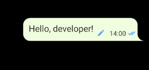
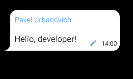
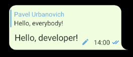
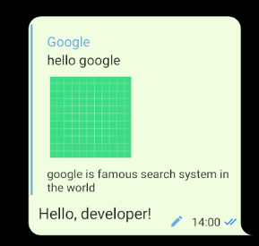
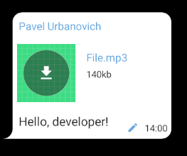
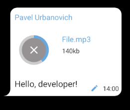
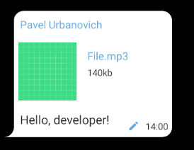

# MessageView

MessageView is a widget for development chat application.


# New Features!

  - Updated .md file


MessageView has the following types:
  - Usual text message
  - Edit message
  - Reply message
  - Link message
  - File message
  - Forward message
  - Audio message (coming soon)


### Installation


```sh
implementation 'com.github.Shebovich:MessageView:0.1.2'
```

### Start work
Create own_message.xml in folder layout.

```sh
<MessageView
            android:id="@+id/messageView"
            android:layout_width="wrap_content"
            android:layout_height="wrap_content"
            android:maxWidth="280dp"
            android:paddingStart="10dp"
            app:setColor="?attr/bubleOwn"
            android:layout_marginBottom="4dp"
            app:setTextColor="?attr/highEmphText" // color for TextViews
            app:setSecondaryColor="?attr/secondaryColor" // color for EditView, ViewedView and etc...
            app:isOwnMessage="true" // flag to show message as own
            app:radius="25"> // radius corners of shape message
</MessageView>
```


Then in your code initialize MessageView and set necessary params.

```sh
MessageView messageView = findViewById(R.id.messageView)
messageView.setTimeText("14:00")
messageView.setMessageText("Hello, developer!");
messageView.setEditedMessage(View.VISIBLE); // if message is edited
messageView.setMessageStatus(MessageView.IS_VIEWED); //if message is viewed
```


To show not own view:

```sh
<MessageView
...
app:isOwnMessage="true"
</MessageView>
```

```sh
messageView.setMessageDisplayName("Pavel Urbanovich");
```



To initialize Reply view add this line:
```sh
messageView.setReplyMessage(replyMessage,replyName);
```


To initialize forward view add this line:
```sh
messageView.setForwardView(forwardName);
```


To initialize Link view add this line:
```sh
messageView.setLinkView("Google","hello google","google is famous search system in the world");
messageView.getLinkImage().setImageResource(drawable);
```


### Files
MessageView contains 3 types of files:

| FILE STATES |
| ------ |
| FILE_DOWNLOAD |
| NOT_DOWNLOAD |
| DOWNLOADING |
```sh
 messageView.setFileNameAndSize("File.mp3","140kb");
 messageView.setFileState(MessageView.NOT_DOWNLOADED, image);
```



```sh
 messageView.setFileState(MessageView.DOWNLOADING, image);
 messageView.setProgress(40);
```

```sh
 messageView.setFileState(MessageView.FILE_DOWNLOAD, image);
```


